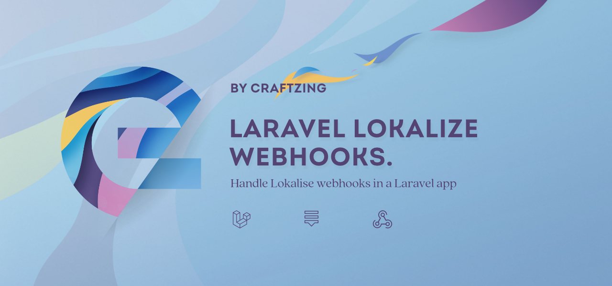

Lokalise offers a bunch of [webhooks](https://docs.lokalise.com/en/articles/3184756-webhooks) you can listen to in order
to get instant notifications about events happening in one of your Lokalise projects. This package aims at helping you
manage these Lokalise events within a Laravel app.

## 🔥 Features

- **Integrates with Laravel events.** Lokalise events get converted to an event you can hook into using 
  [Laravel's event architecture](https://laravel.com/docs/8.x/events).
- **Automatic secret validation.** Every incoming Lokalise requests gets validated automatically to ensure it originates
  from the expected Lokalise project.
- **Plug 'n play common event listeners**. A couple fully optional event listeners you can re-use in any project. 

## 📚 Docs

- [Getting started](/docs/getting-started.md)
- [Usage](/docs/usage.md)
- [Common event listeners](/docs/common-event-listeners.md)

## 📝 Changelog

Check out our [Change log](/CHANGELOG.md).

## 🤝 How to contribute

Have an idea for a feature? Wanna improve the docs? Found a bug? Check out our [Contributing guide](/CONTRIBUTING.md).

## 💙 Thanks to...

- [The entire Craftzing team](https://craftzing.com)
- [All current and future contributors](https://github.com/creaftzing/laravel-lokalise-webhooks/graphs/contributors)
- [Spatie](https://spatie.be). Not only is this package built on top of Spatie's fantastic [Laravel webhook client](https://github.com/spatie/laravel-webhook-client),
its development (and documentation) is also heavily inspired by their [Laravel Stripe webhooks](https://github.com/spatie/laravel-stripe-webhooks) 
package. So we owe them a TON of gratitude!

## 🔑 License

The MIT License (MIT). Please see [License File](/LICENSE) for more information.
